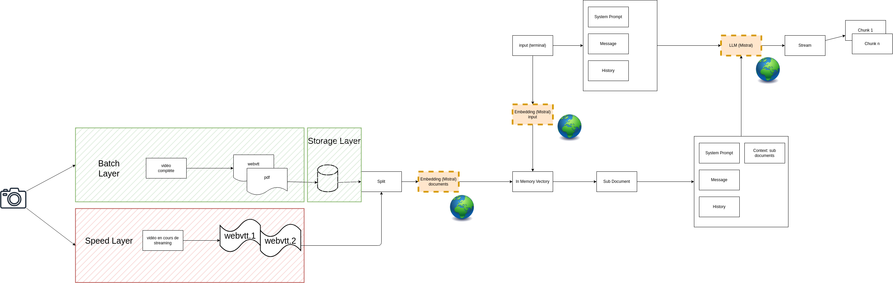

# Chat

## Initialiser le projet

```bash
python -m venv .venv
. ./.venv/bin/activate
```

## Installer les modules nécessaires

```bash
pip install -r requirements.txt
```

## Créer le fichier .env

```bash
LANGSMITH_TRACING="true"
LANGSMITH_API_KEY=...
LANGSMITH_PROJECT="chatboat"
MISTRAL_API_KEY=...
```

## Lancer le script

```bash
python chat.py
```

## Implémentation du RAG

Pour lire et charger les fichiers [WebVTT](https://developer.mozilla.org/en-US/docs/Web/API/WebVTT_API), utiliser [TextLoader](https://python.langchain.com/api_reference/community/document_loaders/langchain_community.document_loaders.text.TextLoader.html#).

## Aperçu

